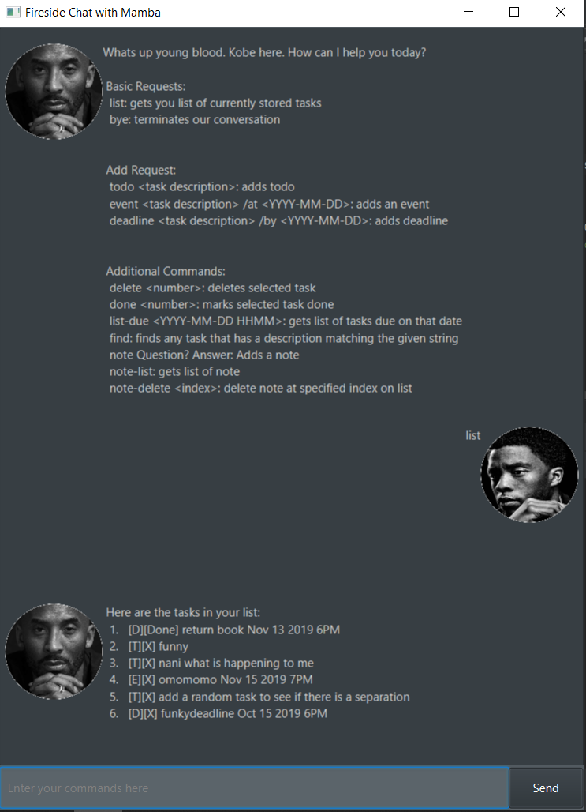

# User Guide
Mamba is a chat bot designed to use via a command line interface while still having the benefits of a Graphical User Interface (GUI). If you can type fast, Mamba can help you store and update tasks faster than traditional GUI apps.

It pays tribute to the two great black men who died in 2020. Kobe Bryant and Chadwick Boseman.
###Quick Start
1. Ensure you have Java 11 or above installed in your machine.
2. Download the latest ip-1.0-SNAPSHOT-all.jar from here.
3. Copy the file to the folder you want to use as the home folder for your Flashnotes.
4. Double-click the file to start the app. The GUI similar to the below should appear in a few seconds. Note how the app contains some sample data.

5. Type the command in the command box and press Enter to execute it. e.g. typing help and pressing Enter will open the help window.
Some example commands you can try (format: explanation):
    - list: gets you list of currently stored tasks
    - bye: terminates our conversation
    - todo [TASK DESCRIPTION]: adds todo
    - event [TASK DESCRIPTION] /at [YYYY-MM-DD HHMM]: adds an event
    - deadline [TASK DESCRIPTION] /by [YYYY-MM-DD HHMM]: adds deadline
    - delete [NUMBER]: deletes selected task
    - done [NUMBER]: marks selected task done 
    - list-due [YYYY-MM-DD HHMM]: gets list of tasks due on that date    
    - find [SEARCH STRING]: finds any task that has a description matching the given string
    - note [QUESTION]? [ANSWER]: Adds a note
    - note-list: gets list of note
    - note-delete [INDEX]: delete note at specified index on list

## Features 
Notes about the command format:
- Words in UPPER_CASE are the parameters to be supplied by the user.
e.g. in add q/QUESTION, QUESTION is a parameter which can be used as add q/In what year was NUS founded?
- Items in square brackets are parameters.
e.g find KEYWORD [MORE_KEYWORDS] can be used as find James or as find James Jake

### `List` - Get current stored list of tasks

Queries the data for the previously stored tasks.

Example of usage: 

`list`

Expected outcome:

>Here are the task in your list: 
> 1. sample task

### `Bye` - Ends the current session of mamba chat bot.

Closes the chat bot.

Example of usage: 

`bye`

Expected outcome:

>Bye. Hope to see you again soon.

### `todo` - add a new to do task

Create a new to do item and add it to the list to be stored.

Example of usage: 

`todo [description]`

Expected outcome:

>Got it, I've added this task: 
>   [D][X] todo description 
> Now you have 1 notes in the list.

### `event` - Add an event to the stored list of tasks

Creates an event object with date time and add to the list of stored tasks.

Example of usage: 

`event [TASK DESCRIPTION] /at [YYYY-MM-DD HHMM]`

Expected outcome:

>Got it, I've added this task: 
>   [E][X] event description Oct 15 2019 6pm 
> Now you have 1 notes in the list.

### `deadline` - Add a deadline to the stored list of tasks

Creates an deadline object with date time and add to the list of stored tasks.

Example of usage: 

`deadline [TASK DESCRIPTION] /at [YYYY-MM-DD HHMM]`

Expected outcome:

>Got it, I've added this task: 
>   [D][X] Deadline description Oct 15 2019 6pm 
> Now you have 1 notes in the list.
    
### `delete` - delete the task from task list at the index specified.

Queries the data for the previously stored tasks and delete the corresponding item.

Example of usage: 

`delete 1`

Expected outcome:

>Noted, I've removed this task: 
>   [D][X] Deadline description Oct 15 2019 6pm 
> Now you have 0 tasks in the list.

### `done` - mark selected task as done

Queries the data for the previously stored tasks and marks selected task as done.

Example of usage: 

`done 1`

Expected outcome:

>Here are the tasks in your list: 
> 1. [D][Done] Deadline description Oct 15 2019 6pm

### `list-due` - Get current stored list of tasks due at specific date time

Queries the data for the previously stored tasks at specific date time.

Example of usage: 

`list-due 2019-10-15 1800`

Expected outcome:

>Here are the task in your filtered list: 
> 1. [D][Done] Deadline description Oct 15 2019 6pm

### `find` - Get tasks with matching string in description.
    
Queries the data for the previously stored tasks, return all with exact matching string in description.

Example of usage: 

`find description`

Expected outcome:

>Here are the task in your filtered list: 
> 1. [D][Done] Deadline description Oct 15 2019 6pm

### `note` - Create new note.
  
Adds a new note object that is created

Example of usage: 

`note What is the meaning of life? Well it's 42.`

Expected outcome:

>Got it, I've added this note: 
>  Question is: What is the meaning of life? 
>   Answer is: Well it's 42. 
> Now you have 1 notes in the list.

### `note-list` - Get list of all notes stored.

Queries the data for the previously stored notes.

Example of usage: 

`note-list`

Expected outcome:

>Here are the notes in your list: 
> 1. Question is: What is the meaning of life? 
>     Answer is: Well its 42.

### `note-delete` - delete note at specified index on list.

Queries the data for the previously stored note, delete note at the specified index.

Example of usage: 

`note-delete 1`

Expected outcome:

>Noted, I've removed this note: 
>   Question is: What is the meaning of life? 
>     Answer is: Well its 42.  
> Now you have 0 notes in the list.

